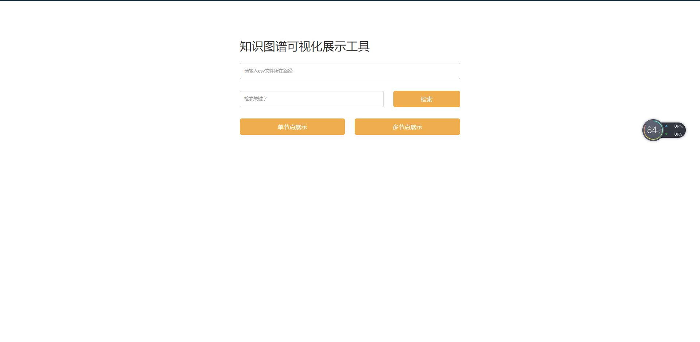

# 基于SpringBoot的csv节点可视化工具

根据本地csv文件，将文件中的各个节点通过图谱的方式可视化展现。

# 系统环境

- Windows/Linux终端：PowerShell/cmd/Linux shell；
- Java环境

# 运行方式

在根目录下运行：`./gradlew bootRun`即可，默认端口是8080，Linux和Windows对应不同的可执行文件。

# 打包方式

在根目录下运行：`./gradlew build`即可在build目录下生成jar包，通过`java -jar xxx.jar`即可运行。

# 原理解析

首页如下图：



## 输入框

首页输入框含义分别如下：

- csv文件所在路径
- 检索关键字

## 检索/单节点展示/多节点展示

读取csv文件所在路径中的所有csv文件，将其提取成Java对象，该对象结构如下：

```Java
public class Node {
    public String source = "";
    public String target = "";
    public String rela = "";
    public String type = "resolved";

    public Node(String source, String target, String rela) {
        this.source = source;
        this.target = target;
        this.rela = rela;
    }
}
```

根据按钮类型的不同，提取的规则也不一样：

- 检索：通过对比关键词与csv文件中节点是否一致，若一致便将该节点添加到List中。

    ```Java
    private static List<Node> doQuery(String path, String source) throws Exception {
        if (Util.isEmpty(path) || Util.isEmpty(source)) {
            return null;
        }
        source = source.trim();
        BufferedReader reader = new BufferedReader(new InputStreamReader(new FileInputStream(path), "UTF-8"));
        String[] title = reader.readLine().split(",");
        String line = null;
        List<Node> nodes = new ArrayList<>();
        String[] sources = source.split(" ");
        
        while ((line = reader.readLine()) != null) {
            String[] item = line.split(",");
            if (item == null || item.length <= 1) continue;
            for (int i = 0; i < item.length; i++)
                for (int j = 0; j < item.length; j++) {
                    if (i == j || Util.isEmpty(item[i]) || Util.isEmpty(item[j]) || title.length <= j
                            || Util.isEmpty(title[j]))
                        continue;
                    boolean flag = false;
                    for (String s: sources) {
                        if (Util.isEquals(s, item[i])) {
                            flag = true;
                        }
                    }
                    if (flag) {
                        nodes.add(new Node(item[i], item[j], title[j]));
                    }
                }
        }
        reader.close();
        return nodes;
    }
    ```

- 单节点展示：固定将csv文件中第一列的数据作为source，其它列数据自由组合。

    ```Java
    private static List<Node> getSimple(String path) throws Exception {
        if (Util.isEmpty(path)) {
            return null;
        }

        BufferedReader reader = new BufferedReader(new InputStreamReader(new FileInputStream(path), "UTF-8"));
        String[] title = reader.readLine().split(",");
        String line = null;
        List<Node> nodes = new ArrayList<>();
        while ((line = reader.readLine()) != null) {
            String[] item = line.split(",");
            if (item == null || item.length <= 1) continue;
            for (int i = 1; i < item.length; i++) {
                if (Util.isEmpty(item[i]) || title.length <= i || Util.isEmpty(title[i]))
                    continue;
                nodes.add(new Node(item[0], item[i], title[i]));
            }
        }
        reader.close();
        return nodes;
    }
    ```

- 多节点展示：csv中所有列的数据自由组合。

    ```Java
    private static List<Node> getMulti(String path) throws Exception {
        if (Util.isEmpty(path)) {
            return null;
        }

        BufferedReader reader = new BufferedReader(new InputStreamReader(new FileInputStream(path), "UTF-8"));
        String[] title = reader.readLine().split(",");
        String line = null;
        List<Node> nodes = new ArrayList<>();
        while ((line = reader.readLine()) != null) {
            String[] item = line.split(",");
            if (item == null || item.length <= 1) continue;
            for (int i = 0; i < item.length; i++)
                for (int j = 0; j < item.length; j++) {
                    if (i == j || Util.isEmpty(item[i]) || Util.isEmpty(item[j]) 
                    || title.length <= j || Util.isEmpty(title[j]))
                        continue;
                    nodes.add(new Node(item[i], item[j], title[j]));
                }
        }
        reader.close();
        return nodes;
    }
    ```

在获取了上述Node的列表后，返回到前端js代码中获取节点数据，并通过[KG-View](https://github.com/ownthink/KG-View)中提供的方式，将节点数据通过可视化网页展示。

# 注意

文件格式只能使用csv，且UTF-8编码。
